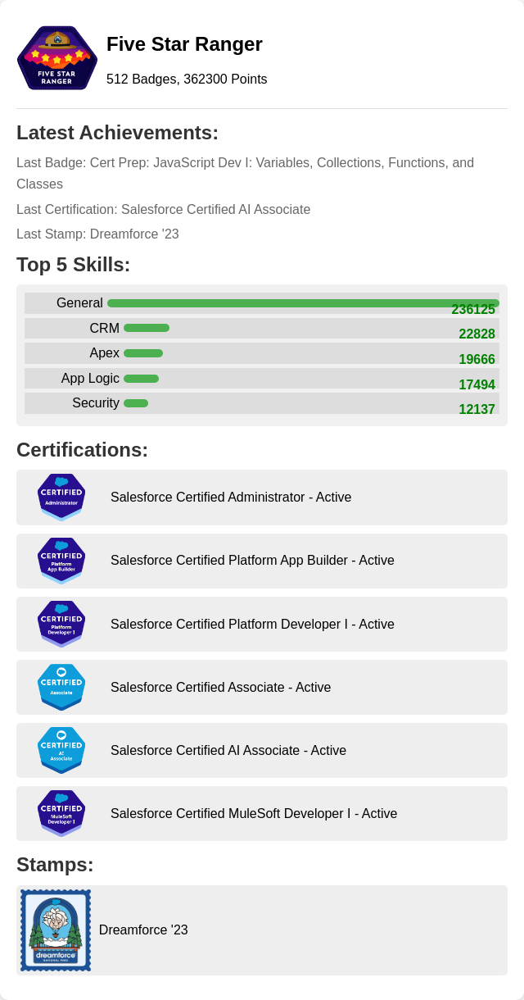

### Hi there 👋
My name is Marek Oleksik, and I am passionate about Salesforce solutions and programming. I hold three Salesforce certifications: Associate, Administrator, and Platform Developer 1, confirming my advanced knowledge and skills in the Salesforce platform. Additionally, I completed postgraduate studies at the Warsaw University of Technology, where I gained expertise in Java programming, expanding my technical competencies. My experience includes working on Salesforce implementation projects and developing applications on this platform. With my acquired skills, I can effectively design, customize, and optimize CRM solutions, ensuring clients receive the best support and business efficiency. I am motivated to continually grow and explore new opportunities to create innovative and valuable solutions for clients.

<!--TH_Stats:start-->

<!--TH_Stats:end-->

<!--
**MarekOleksik/MarekOleksik** is a ✨ _special_ ✨ repository because its `README.md` (this file) appears on your GitHub profile.

Here are some ideas to get you started:

- 🔭 I’m currently working on ...
- 🌱 I’m currently learning ...
- 👯 I’m looking to collaborate on ...
- 🤔 I’m looking for help with ...
- 💬 Ask me about ...
- 📫 How to reach me: ...
- 😄 Pronouns: ...
- ⚡ Fun fact: ...
-->
